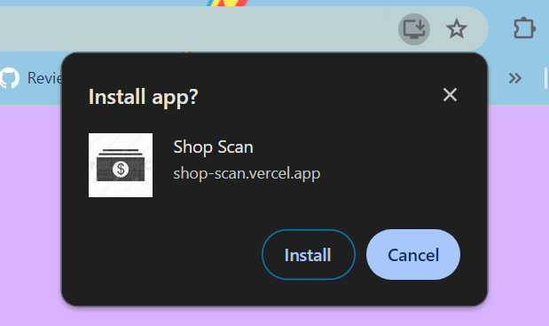
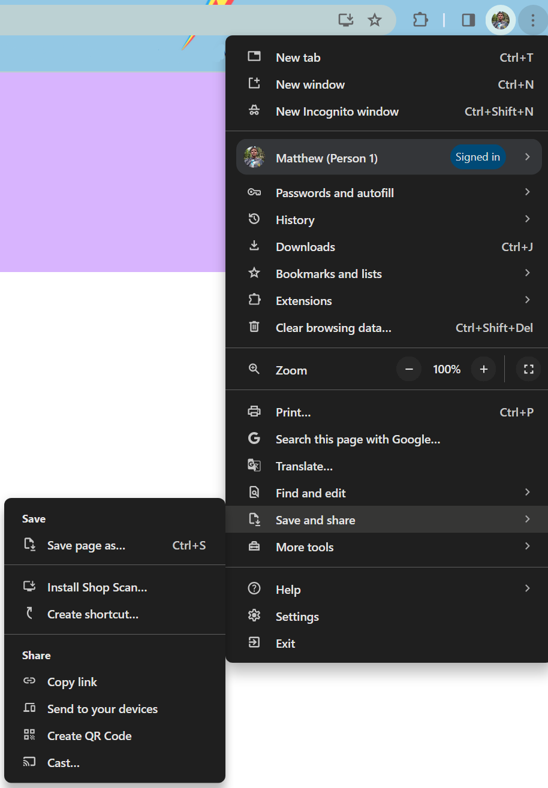

# Shop Scan

Shop Scan is a solution to an issue that many shop owners in 3rd world countries have to deal with.
While checking customers out, a shop owner or employee has to tabulate the items that a customer is
planning to purchase, sum the cost of the items, and also keep track of the shop inventory. All of this
is typically done by hand due to the lack of Point of Sales systems, using up valuable time of the
customer and owner or employee. Shop Scan solves this issue by integrating a shop's inventory,
shopping cart, sales statistics, and scanning of an object into a single phone app.

Shop Scan uses GPT4 Vision to identify an item and, based on the identification of the item, add it
to the cart. Upon checking out, the inventory is updated to remove those items that were purchased.

## How do I use this app?

Go to the website [Shop Scan](https://shop-scan.vercel.app/) and install the page

### On Chrome:

In the address bar, click the monitor icon with the down arrow and click Install.

In the upper right, select the three dots > Save & Share > Install Shop Scan...

